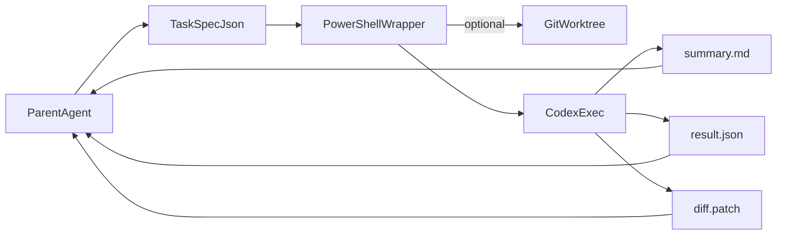

# agents_tree

`agents_tree` is a minimal reference implementation for using `Cursor` as a parent orchestrator and `Codex CLI` as a delegated subagent.

The core idea is simple:

- the parent agent defines the task, scope, and constraints
- a wrapper script converts that task into a stable `codex exec` invocation
- Codex runs in either read-only mode or a writable isolated worktree
- the run emits durable artifacts such as `summary.md`, `result.json`, and `diff.patch`

This repository packages the implementation logic and the helper files required to reproduce that flow.

## Repository Layout

- `scripts/codex-subagent.ps1`: PowerShell wrapper that launches `Codex CLI`
- `tools/codex_orchestrator.py`: lightweight task generator and launcher
- `tools/batch_runner.py`: parallel batch runner with dependency management
- `tools/codex-subagent-prompt.md`: prompt template for delegated runs
- `tools/codex-task.example.json`: single task spec example
- `tools/batch-task.example.json`: batch task spec example
- `docs/implementation.md`: architecture, execution flow, and practical notes
- `docs/cursor-codex-experience-report.md`: real-world usage report (Chinese)
- `.cursor/rules/codex-delegation.mdc`: Cursor rule for when to delegate

## Workflow



## Requirements

- Windows PowerShell
- `git`
- `node` and `npm`
- `Codex CLI`

Install Codex CLI:

```powershell
npm install -g @openai/codex
codex login
```

Codex CLI supports non-interactive execution via `codex exec`, which is what this repository uses for automation. See the upstream project and official docs for the base CLI behavior: [openai/codex](https://github.com/openai/codex) and the OpenAI docs for [non-interactive mode](https://developers.openai.com/codex/noninteractive) and the [CLI reference](https://developers.openai.com/codex/cli/reference).

## Quick Start

Run a task in writable mode:

```powershell
powershell -ExecutionPolicy Bypass -File .\scripts\codex-subagent.ps1 `
  -TaskFile .\tools\codex-task.example.json
```

Or let the orchestrator generate the task file for you:

```powershell
python .\tools\codex_orchestrator.py `
  --goal "Inspect the auth flow and summarize redirect behavior" `
  --scope app.py `
  --scope templates/login.html `
  --readonly `
  --no-worktree
```

Run a task in read-only mode:

```powershell
powershell -ExecutionPolicy Bypass -File .\scripts\codex-subagent.ps1 `
  -TaskFile .\tools\codex-task.example.json `
  -Readonly
```

Run directly in the current repository instead of an isolated worktree:

```powershell
powershell -ExecutionPolicy Bypass -File .\scripts\codex-subagent.ps1 `
  -TaskFile .\tools\codex-task.example.json `
  -NoWorktree
```

Run with automatic retry on transient API errors (e.g. 503):

```powershell
powershell -ExecutionPolicy Bypass -File .\scripts\codex-subagent.ps1 `
  -TaskFile .\tools\codex-task.example.json `
  -MaxRetries 3 `
  -Timeout 600
```

## What The Script Produces

Each task writes output under its configured `output_dir`:

- `prompt.md`
- `summary.md`
- `codex.stdout.log`
- `codex.stderr.log`
- `git-status-before.txt`
- `git-status.txt`
- `diff.patch`
- `result.json`

The wrapper captures both the baseline dirty state and the post-run dirty state so the parent agent can distinguish:

- files that were already dirty before the run
- files that are dirty after the run
- files that changed because of the delegated task

## Cursor Rule

The repository also includes a project rule in `.cursor/rules/codex-delegation.mdc`.

That rule tells the parent agent to prefer delegation when:

- the task is bounded and can be expressed as a clear goal plus scope
- durable artifacts like `summary.md` or `result.json` are useful
- the parent agent wants to reduce context pollution in the main conversation

The expected flow is:

1. Generate a task JSON.
2. Launch the child run with `tools/codex_orchestrator.py` or `scripts/codex-subagent.ps1`.
3. Read `summary.md` and `result.json`.
4. Decide whether to apply or continue from the delegated output.

## Real-World Usage

This toolchain was used to build [Autofish](https://github.com/clouditera/autofish), a FastAPI + Vue 3 SaaS platform. Over the course of development, 12+ Codex tasks were orchestrated across 3 batches covering backend APIs, frontend pages, and integration tests.

A detailed experience report — including problems encountered, solutions, and best practices — is available in [`docs/cursor-codex-experience-report.md`](docs/cursor-codex-experience-report.md).

## Notes

- The implementation is intentionally minimal and favors scriptability over deep editor integration.
- On Windows, worktree and sandbox behavior can surface edge cases around `git safe.directory` and PowerShell policy constraints. Those trade-offs are documented in `docs/implementation.md`.
